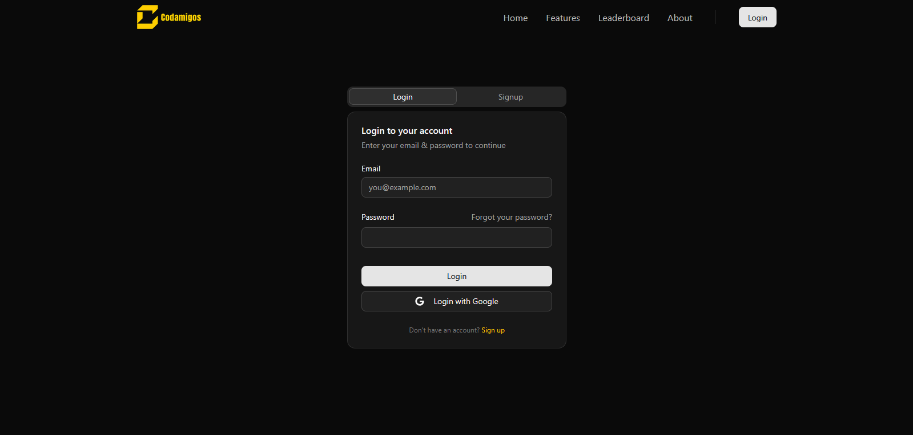
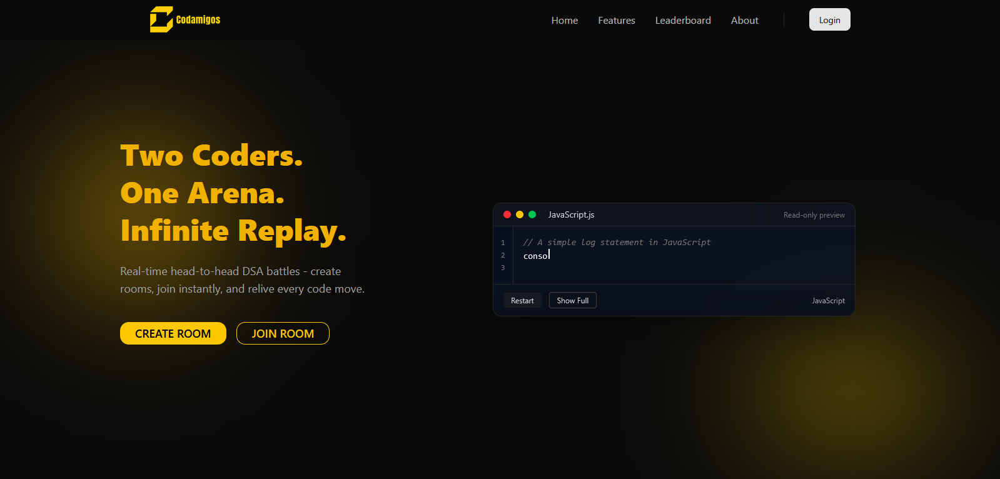
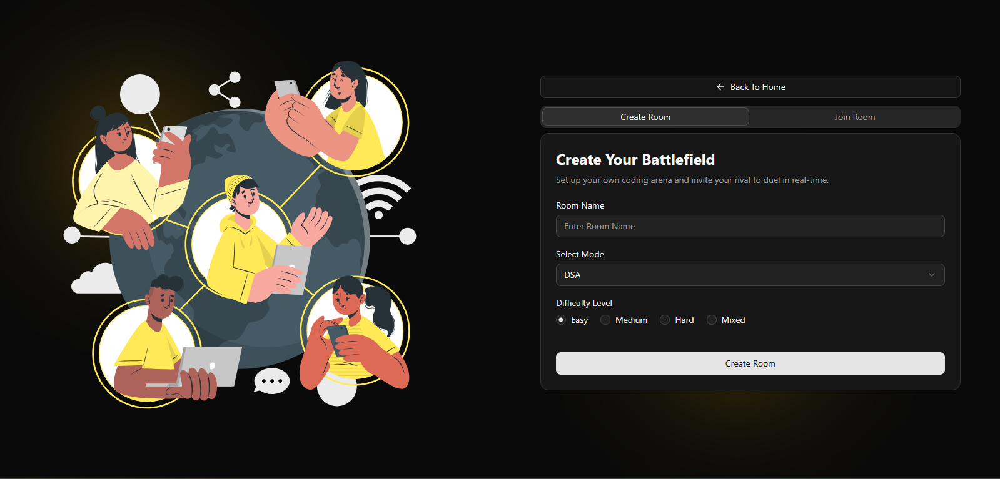

# 💻 Codamigos: The 1v1 Real-Time Coding Duel Platform

A lightweight web app for developers to face off in coding problems. DuelCode is designed for **quick matches, live judging, and ranked ladders**, perfect for friendly competition, practice, and small tournaments.

---

## 🎯 What Codamigos Is

Codamigos is a web application that pits two developers against each other on coding challenges. Each duel is:

* **Timed:** Adding an intense, competitive element.
* **Automatically Judged:** Providing instant feedback.
* **Scored:** Based on both **correctness** and **speed**.

---

## ✨ Key Features

The platform is built around speed and real-time interaction:

### ⚡ Match Experience
* **Real-time match lobby:** Instant pairing and starting.
* **Synchronous judging:** Instant test results and leaderboard updates during the match.
* **Optional chat and trash-talk:** For a full competitive experience.
* **Replayable match summary:** Detailed breakdown with per-test results after the duel.

### 🧩 Problem & Selection
* **Multiple Problem Types:** Challenges categorized as **Easy, Medium, and Hard**.
* **Problem pool:** Vast collection with difficulty tags and random selection for fair play.

### 🏆 Ranking & Competition
* **Elo-style rating system:** For fair matchmaking and dynamic ranked ladders.

---

## ♟️ Scoring & Ranking Breakdown

We use a competitive, performance-based system:

| Metric | Detail |
| :--- | :--- |
| **Points** | Awarded per passed test case. Points are weighted by problem difficulty and solution runtime. |
| **Ranking** | An **Elo-like rating algorithm** governs matchmaking and drives the global leaderboards. |

---

## 🚀 Getting Started

### 📋 Prerequisites

Before running this project, ensure you have the following installed:

* **Node.js** v18.0.0 or higher ([Download](https://nodejs.org/))
* **npm** v9.0.0 or higher (comes with Node.js)
* **Docker Desktop** (for Judge0 code execution engine)
* **Git** for version control
* **Firebase Account** (for authentication and database)

Verify your installations:
```bash
node --version  # Should be v18+
npm --version   # Should be v9+
docker --version
```

---

## 🛠️ Installation & Setup

### 1️⃣ Clone the Repository

```bash
git clone https://github.com/AkshatRaval/Codamigos-DSA-Duel-Web-App.git
cd Codamigos-DSA-Duel-Web-App
```

### 2️⃣ Firebase Configuration

#### A. Create a Firebase Project
1. Go to [Firebase Console](https://console.firebase.google.com/)
2. Create a new project or use an existing one
3. Enable **Authentication** (Email/Password provider)
4. Enable **Firestore Database**
5. Enable **Realtime Database**

#### B. Get Firebase Credentials

**For Server (Admin SDK):**
1. Go to **Project Settings** → **Service Accounts**
2. Click **"Generate New Private Key"**
3. Save the downloaded JSON file as `keyFirebase.json` in the `server/` folder

**For Client (Web App):**
1. Go to **Project Settings** → **General**
2. Scroll to **"Your apps"** → Add a **Web app** if you haven't
3. Copy the Firebase configuration object

#### C. Set Up Environment Variables

**Server `.env` file** (`server/.env`):
```env
RTDB_URL=https://your-project-id-default-rtdb.firebaseio.com
PORT=3000
```

**Client `.env` file** (`client/.env`):
```env
VITE_FIREBASE_API_KEY=your_api_key
VITE_FIREBASE_AUTH_DOMAIN=your-project-id.firebaseapp.com
VITE_FIREBASE_PROJECT_ID=your-project-id
VITE_FIREBASE_STORAGE_BUCKET=your-project-id.firebasestorage.app
VITE_FIREBASE_MESSAGING_SENDER_ID=your_sender_id
VITE_FIREBASE_APP_ID=your_app_id
VITE_FIREBASE_MEASUREMENT_ID=your_measurement_id
VITE_FIREBASE_DATABASE_URL=https://your-project-id-default-rtdb.firebaseio.com
```

### 3️⃣ Install Dependencies

**Install server dependencies:**
```bash
cd server
npm install
```

**Install client dependencies:**
```bash
cd ../client
npm install
```

### 4️⃣ Set Up Judge0 (Optional - for code execution)

Judge0 is used for compiling and running submitted code.

```bash
cd ../judge0
docker-compose up -d
```

Judge0 will be available at `http://localhost:2358`

---

## ▶️ Running the Application

### Start the Server

Open a terminal and run:
```bash
cd server
npm run dev
```

Server will start on `http://localhost:3000`

### Start the Client

Open a **new terminal** and run:
```bash
cd client
npm run dev
```

Client will start on `http://localhost:5173` (or another port if 5173 is busy)

### Access the Application

Open your browser and navigate to:
```
http://localhost:5173
```

---

## 🛑 Stopping the Application

Press **Ctrl + C** in each terminal to stop the server and client.

To stop Judge0:
```bash
cd judge0
docker-compose down
```

---

## 📦 Available Scripts

### Server Scripts
* `npm run dev` - Start development server with hot reload (nodemon)
* `npm start` - Start production server

### Client Scripts
* `npm run dev` - Start development server (Vite)
* `npm run build` - Build for production
* `npm run preview` - Preview production build
* `npm run lint` - Run ESLint

---

## 📸 Application Screenshots

### 🔐 Login Page

*User authentication interface*

### 🏠 Home Page

*Landing page with "Code, Win, Repeat" - Create or join rooms instantly*

### 🎮 Create Room Interface

*Set up your coding arena with room name, mode selection, and difficulty level*

### 🚪 Join Room Interface

*Enter room code to join your rival's coding showdown*

---

## 🏗️ Project Structure

```
Codamigos-DSA-Duel-Web-App/
├── client/              # React + Vite frontend
│   ├── src/
│   │   ├── pages/       # Page components
│   │   ├── components/  # Reusable UI components
│   │   ├── redux/       # State management
│   │   └── lib/         # Utilities and API
│   └── public/          # Static assets
├── server/              # Node.js + Express backend
│   ├── controllers/     # Business logic
│   ├── routes/          # API routes
│   └── utils/           # Helper functions
└── judge0/              # Judge0 Docker setup
```

---

## 🤝 Contributing

We welcome contributions to DuelCode! Follow these steps to get involved:

1.  **Fork the repo.**
2.  Create a feature branch: `feature/your-thing` (e.g., `feature/dark-mode`).
3.  Add **tests** for your code and update the **documentation** if necessary.
4.  Open a **pull request (PR)** and request a review.

---

## 📞 Contact

For core development questions, potential collaborations, or to request write access to the repository, please reach out to the project owner:

📧 **akshatraval199@gmail.com** (Owner)
📧 **aayushjain22002@gmail.com** (Contributor)
